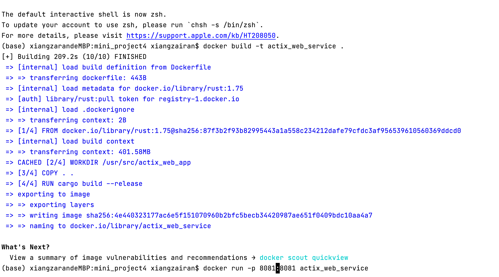
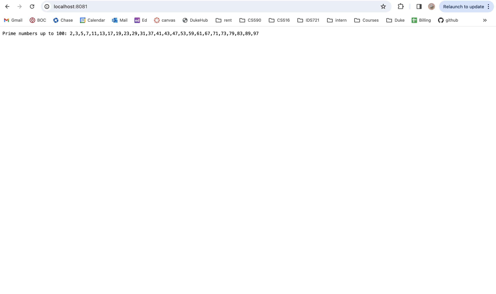

# zx122_mini_project_4

Week4 mini project: Containerize a Rust Actix Web Service
- simple Rust Actix web app that prints prime numbers from 0 to 100 on the screen
- build Docker image and run the container locally

## Author

Zairan Xiang

## Steps:

1. Install Docker [link](https://www.docker.com/get-started/)
2. on local computer, do ```cargo new your_executable``` to create a new Rust Project and cd into this ```your_executable``` folder.
3. Add dependencies ```actix-web = "4"``` to Cargo.toml file.
4. Write the find_prime program in the src/main.rs file using actix_web to put the result on port 8081
5. ```cargo build``` and ```cargo run``` to test if the main.rs execute successfully without error.
6. Containerize the Rust Actix Web App: 
- create a new file call ```Dockerfile``` inside the home directory (your_executable directory)
- inside the dockerfile:
- FROM node:14: Use the official Node.js 14 image as the base image.
- WORKDIR /usr/src/app: Set the working directory inside the container.
- COPY . .: Copy the current directory (where the Dockerfile is located) into the container.
- RUN cargo build --release: Build the Rust project
- WORKDIR /usr/src/app: Set the working directory for the final image
- EXPOSE 8081: Expose port 8081. This doesn't actually publish the port; it's just for documentation purposes.
- CMD ["./your_executable_name"]: Command to run the application
7. Run docker build: ```docker build -t your_executable .```

8. Run the Container locally: ```docker run -p 8081:8081 your_executable```
9. Access the webservice at http://localhost:8081

